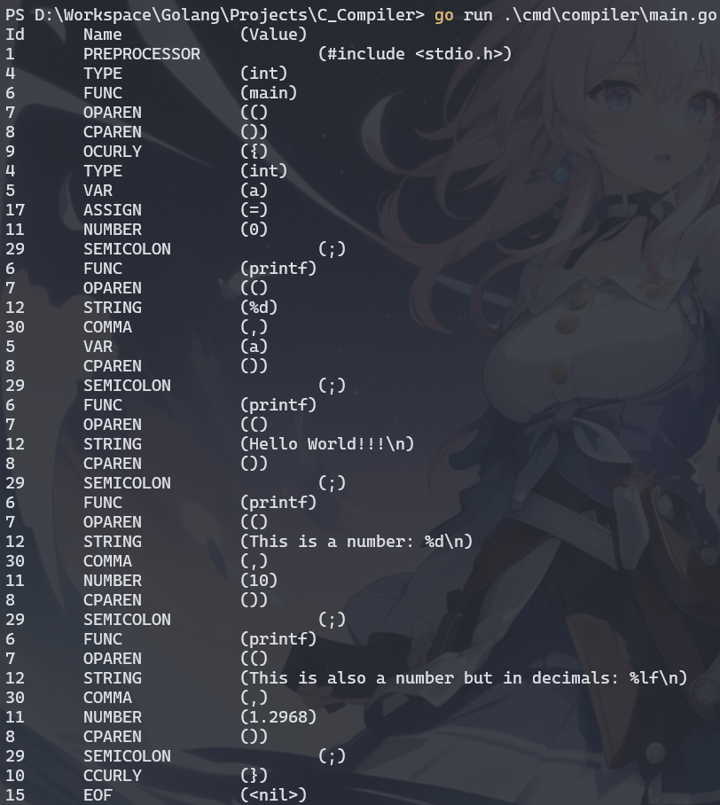

# C_Lexer

## 📌 Overview

An attempt to make a C lexer in Go. Not quite polished and fully functional but from this, i can learn how to make a lexer, and maybe a parser and compiler in the near future... 

About learning sources, i watched:
- Tsoding's [Military Grade C/C++ Lexer from Scratch](https://youtu.be/AqyZztKlSGQ?si=8VvN0P8PbarUr3Rb)
- Tsoding's [Ok, i made C compiler in PHP (c.php Ep.01](https://youtu.be/Yi6NxMxCFY8?si=5msG4qRTffHirmnY)
- LLVM's [Kaleidoscope: kaleidoscope Introduction and the Lexer](https://llvm.org/docs/tutorial/MyFirstLanguageFrontend/LangImpl01.html)

## 🔨 Installation

### Prerequisites

- Golang version >= 1.22.5

### Running

In the directory that you put the project directory on, type this following command in the terminal:

```bash
cd .\C_Lexer\cmd\compiler

```

Use your favorite text/code editor (I use neovim btw) and open main.go file in the same directory.

The main() function should look like this:

```go
func main() {
	fileName := "internal/example/hello.c"

	source, err := os.ReadFile(fileName)
	if err != nil {
		log.Fatal(fmt.Sprintf("[FILEIO]: ERROR: Failed to open file <%v>", fileName))
	}
	Tokenize(source)

	// Parse(source)
}

```

NB:
- You can change the fileName variable to the path of your C file.
- Tokenize() will read your C file and tokenize it in to tokens defined in `internal/lexer/token.go`: 

```go
const (
	UNDEFINED TokenKind = iota
	PREPROCESSOR
	COMMENT
	KEYWORD
	TYPE
	VAR
	FUNC
	OPAREN
	CPAREN
	OCURLY
	CCURLY
	NUMBER
	STRING
	CHAR
	RETURN
	EOF
	ERROR
	// Logical operations
	ASSIGN
	NOT
	NOTEQ
	EQ
	LT
	GT
	LTE
	GTE
	ADD
	SUB
	MUL
	DIV
	// Punctuation
	SEMICOLON
	COMMA
	DOT
)

```

- Parse() will parse all of the tokens and put them in expressions, statements and declarations to form an Abstract Syntax Tree (AST).
> [!IMPORTANT]
> I haven't finished this part yet cause of the many roadblocks like how to print the syntax tree if i declare a variable inside an assign expression then turn them into statement :)?

Let's get to the fun part, in the terminal, same directory, run this command (Make sure you have go installed):

```bash
go run main.go
```

## 📖 Example

This is the hello.c file:

```C
#include <stdio.h>

int main() {
  int a = 0;
  printf("%d", a);
  printf("Hello World!!!\n");
  printf("This is a number: %d\n", 10);
  printf("This is also a number but in decimals: %lf\n", 1.2968);
}
```

After tokenization, it should return:

  

## 📫 Feedbacks

If you have any problems, feel free to open an issue. 
Thank you for your time...
